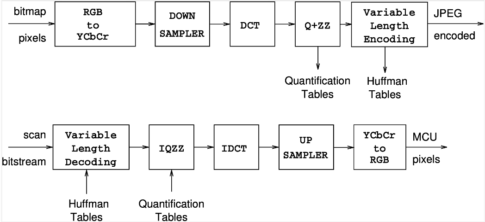
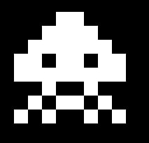

# JPEG Decoder from Scratch

This project is a JPEG decoder implemented from scratch in C. It reads JPEG files, decodes them, and outputs the resulting images in PPM/PGM format. The decoder handles all major JPEG stages, including Huffman coding, quantization, and color space conversion.

The decoder parses the input JPEG file and reconstructs the pixel data, saving the result as a `.pgm` (grayscale) or `.ppm` (color) file.


## JPEG Decoding Pipeline

This project implements the standard JPEG decoding pipeline, which reverses the encoding process. Our implementation follows this high-level architecture (the encoding process is shown for context):



## Images of Increasing Complexity
We built the decoder incrementally, validating each part of the pipeline step-by-step. Our testing strategy relied on images of increasing complexity to ensure the decoder was robust. We started with simple grayscale images and gradually moved to more complex color images with various compression levels.

| Invader | Albert | Biiiiiig |
| :---: | :---: | :---: |
|  |  |  |


## Core Features & Data Structures

### Key Features Implemented
- **Header Parsing:** Extracts all markers (SOF, DHT, DQT, SOS).
- **Huffman Decoding:** Builds Huffman trees and decodes the variable-length bit stream.
- **Inverse Quantization:** Rescales the coefficients using the DQT tables.
- **Zig-Zag Reordering:** Reorders the 8x8 blocks from a 1D stream back into 2D.
- **Inverse DCT (iDCT):** Transforms frequency coefficients back into spatial pixel values.
- **YCbCr to RGB Conversion:** Converts the color space to standard RGB for the final image.
- **PPM/PGM Output:** Writes the final pixel data to a file.

### Core Data Structures
- **`struct header`**: A master struct that holds all metadata extracted from the JPEG headers, including Huffman trees, quantization tables, and pre-calculated sine values for iDCT acceleration.
- **Huffman Tree**: A standard binary tree used to decode the variable-length Huffman codes. It is built using a queue (breadth-first) to construct the tree level by level.
- **`struct extended_FILE`**: A custom file wrapper that allows reading an arbitrary number of bits from the file stream (e.g., 1, 5, or 13 bits at a time), which is essential for parsing the JPEG bit stream.

## How to Compile and Run

To compile the project, use the provided Makefile:

```bash
make
```

To run the decoder on a JPEG file:

```bash
bin/jpeg2ppm images/invader.jpeg
```

The output image will be saved in the `out/` directory as `invader.pgm` or `invader.ppm` depending on whether the input image is grayscale or color.

